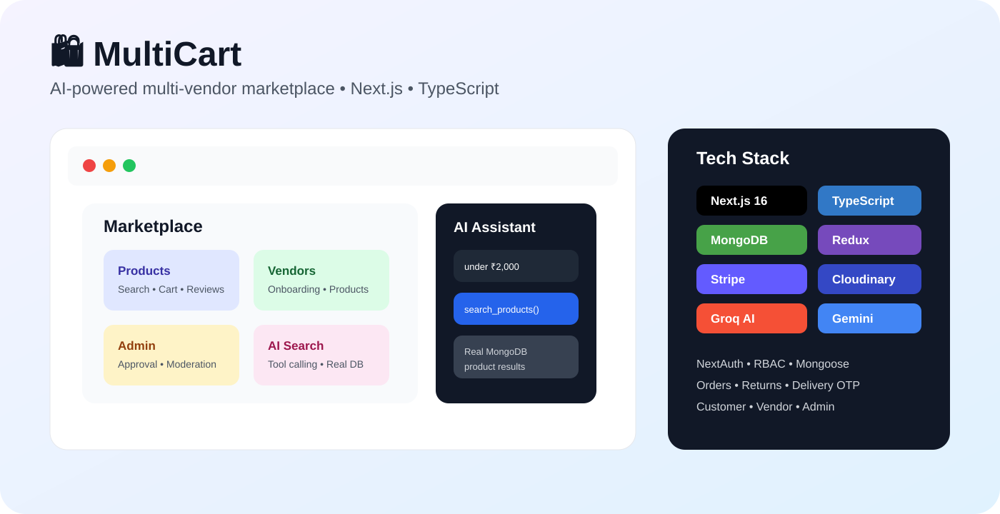
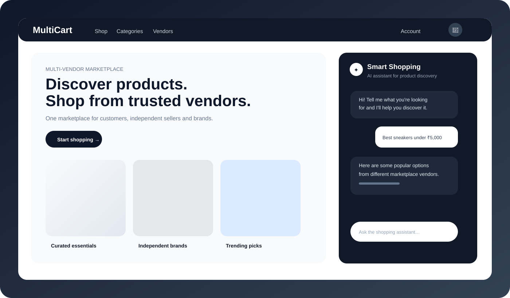
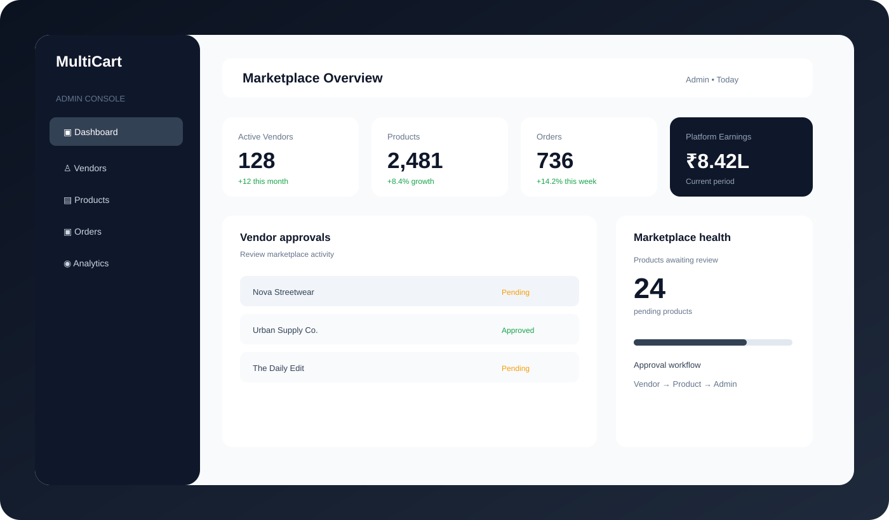

# 🛍️ MultiCart — AI Multi-Vendor E-Commerce Marketplace

<p align="center"></p>

<p align="center"><strong>A production-oriented marketplace where customers, vendors and administrators operate through role-based workflows, with AI product discovery, payments, moderation, order lifecycle management and cloud media.</strong></p>

<p align="center"><a href="https://multivendor-six.vercel.app/">🚀 Live Demo</a> · <a href="https://github.com/duttasirius/multivendor">💻 Source Code</a></p>

## ⚡ At a Glance

| Area | Implementation |
|---|---|
| 🖥️ App | Next.js 16, React 19, TypeScript 5 |
| 🎨 UI | Tailwind CSS 4, Framer Motion, Lucide |
| 🧠 AI | Groq / GPT-OSS 20B tool calling + Gemini/OpenAI SDKs |
| 🗄️ Data | MongoDB + Mongoose |
| 🔐 Auth | NextAuth 5 + role-based access |
| 🧠 State | Redux Toolkit |
| 💳 Payments | Stripe + COD; Razorpay capability |
| ☁️ Media | Cloudinary |

## 🚀 Why This Project Stands Out

MultiCart is designed around **real marketplace boundaries**, not just product CRUD.

```text
Customer ─────┐
              ├── Marketplace ── MongoDB
Vendor ───────┤        │
              │        ├── Stripe / COD
Admin ────────┘        ├── Cloudinary
                       └── AI search
```

### 🤖 AI Shopping Assistant

The assistant accepts natural-language requests such as:

```text
Find black running shoes
Show products under ₹1,000
I want something with free delivery
Show electronics available for COD
```

The model does not invent catalog data. It can call a structured `search_products` tool with query/category/price/delivery filters; the server queries MongoDB and returns **active, approved, in-stock products**.

```text
Customer message
      ↓
LLM intent parsing
      ↓
search_products tool
      ↓
MongoDB business-rule filters
      ↓
Real product records
      ↓
Product cards in chat
```

**Recruiter takeaway:** demonstrates how to connect an LLM to transactional data while keeping inventory and pricing under server/database control.

### 🏪 Vendor Platform

- Vendor registration and onboarding
- Shop/business information
- Admin approval and verification
- Vendor-owned products
- Product creation and management
- Product active/inactive state
- Product moderation workflow
- Vendor order operations

### 👑 Admin Governance

- Vendor approval / status management
- Product approval and rejection
- Marketplace moderation
- Order monitoring
- Operational statistics and seller/product visibility

### 🛒 Customer Commerce

- Product/category discovery
- Product details and multi-image galleries
- Cart and address management
- Checkout
- Order history and tracking
- Cancellation and returns
- Delivery OTP verification
- Product reviews and ratings

### 💳 Order & Payment Lifecycle

Orders model the full lifecycle:

`pending → confirmed → shipped → delivered → returned / cancelled`

Order records track buyer/vendor, line items, pricing, delivery/service charges, payment state, Stripe details, cancellation/return information and delivery verification.

### 🔐 Authentication & Security

- NextAuth-based sessions
- Customer / vendor / admin role boundaries
- Protected server-side routes
- Password hashing
- Environment-based secrets
- Server-side payment handling and webhook verification infrastructure

## 🖼️ Product Visuals

<p align="center">
  
  
</p>

## 🏗️ Architecture

```text
                         Next.js 16
              Customer / Vendor / Admin UI
                           │
          ┌────────────────┼────────────────┐
          ▼                ▼                ▼
      NextAuth          App APIs       Redux Toolkit
          │                │
          │        ┌───────┼────────┐
          │        ▼       ▼        ▼
          │     Search   Orders   Admin/Vendor
          │        │       │        │
          └────────┼───────┼────────┘
                   ▼       ▼
                MongoDB  Stripe
                   │
                   ├── Cloudinary
                   └── AI tool calling
```

## 🧰 Technology Stack

**Frontend:** Next.js 16 · React 19 · TypeScript 5 · Tailwind CSS 4 · Redux Toolkit · Framer Motion · Lucide React

**Data / Backend:** Next.js Route Handlers · MongoDB · Mongoose · Axios · bcryptjs · Nodemailer

**AI:** Groq SDK · GPT-OSS 20B · Google GenAI SDK · OpenAI SDK

**Services:** Stripe · Razorpay SDK · Cloudinary · NextAuth

## 🎯 Interview Talking Points

- LLM tool calling vs. free-form chatbot responses
- Keeping MongoDB as the source of truth
- Marketplace role boundaries and approval states
- Vendor product ownership and moderation
- Payment/order consistency
- Delivery OTP verification
- Server-side authorization and secrets
- Designing a multi-actor commerce domain in one Next.js application

## 📁 Structure

```text
src/
├── app/api/       # auth, chat, search, order, admin, vendor APIs
├── app/           # customer marketplace and commerce pages
├── components/   # customer / vendor / admin UI
├── lib/           # services and AI utilities
├── model/         # Mongoose models
└── redux/         # client state
```

## 🔑 Local Development

```bash
git clone https://github.com/duttasirius/multivendor.git
cd multivendor
npm install
npm run dev
```

Configure MongoDB, authentication, payment, Cloudinary and AI environment variables locally. Never commit production credentials.

## 📌 Recruiter Snapshot

**MultiCart demonstrates:** Next.js + TypeScript · full-stack architecture · RBAC · marketplace governance · MongoDB/Mongoose · AI tool calling · payments · order state machines · vendor systems · admin systems · Cloudinary · Redux · responsive UI.
